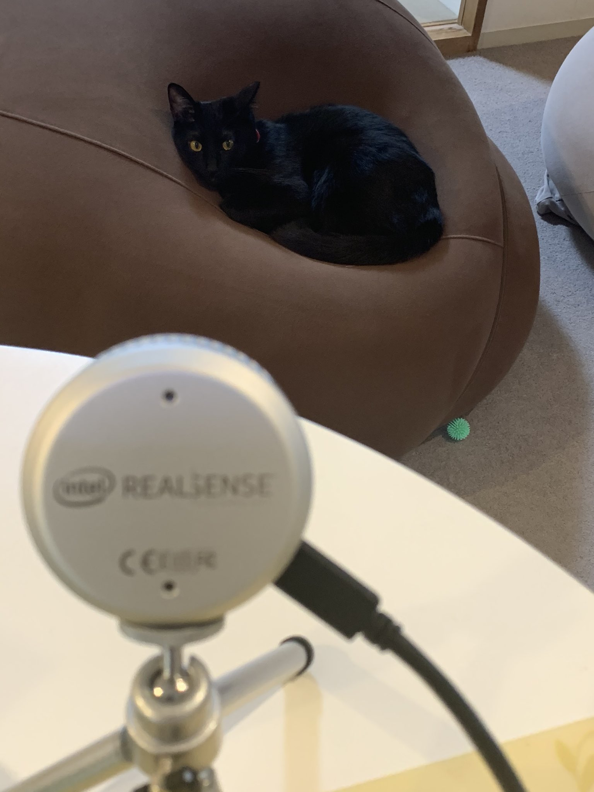

# 黒猫LiDAR実験

## 序論

近年、猫の写真が人気である。例えば、次のような事例があり、2021年3月現在、6万弱のいいねを稼いでいる。

<blockquote class="twitter-tweet" data-partner="tweetdeck">
起きて上を見たら猫大橋が掛かっていた。 <a href="https://t.co/1tCBTL06vj">pic.twitter.com/1tCBTL06vj</a>
&mdash; 上田 隆一 (@ryuichiueda) <a href="https://twitter.com/ryuichiueda/status/1304174807563427841?ref_src=twsrc%5Etfw">September 10, 2020</a></blockquote>

しかし、猫のdepth画像については未だ事例が少ない。そこで、猫のdepth画像を撮影し、Twitterに掲載することで、いいねを稼ぐことを目的とする。

## 実験環境

次のように、猫をソファーに設置し、1m程度の距離から計測する。

猫としては黒猫、センサとしてはIntel社製RealSense L515を用いる。

## 実験結果

L515の結果を示す。

<blockquote class="twitter-tweet" data-partner="tweetdeck">
悲報：黒猫，LiDARのレーザーを吸収． <a href="https://t.co/eXpjAynrOz">pic.twitter.com/eXpjAynrOz</a>
&mdash; 上田 隆一 (@ryuichiueda) <a href="https://twitter.com/ryuichiueda/status/1368839305104293890?ref_src=twsrc%5Etfw">March 8, 2021</a></blockquote>

猫の種類を間違えたため、LiDARから照射される光線が吸収され、猫のdepth画像は得られなかった。

## 議論

上図が示すように、実験は失敗した。しかし、失敗した原因の意外性から、多くのいいねが稼げたので、これはこれでよいのではないだろうか。また、猫ダークマター説など、新たな仮説を検証する動機を得た。

<blockquote class="twitter-tweet" data-conversation="none" data-cards="hidden" data-partner="tweetdeck">
黒猫ダークマター仮説の誕生じゃった。
&mdash; SoftwareDesign (@gihyosd) <a href="https://twitter.com/gihyosd/status/1368845305668534275?ref_src=twsrc%5Etfw">March 8, 2021</a></blockquote>

## 結論・今後の展望

猫は元来胴体もツイートもよく伸びることが知られている［要出典］が、本実験でも同様の効果が見られた。残念ながら、研究の小難しいツイートよりも伸びる。

真面目な研究についても、多くの人に興味を持ってもらうことが今後の課題となる。そして、新3年生の皆様に上田研を志願してもらえるようにいろいろ発信することも必要である。

## appendix

<blockquote class="twitter-tweet" data-partner="tweetdeck">
1枚目: D435 2枚目: L515  特性が違って面白い． <a href="https://t.co/831c5Goc4B">pic.twitter.com/831c5Goc4B</a>
&mdash; 上田 隆一 (@ryuichiueda) <a href="https://twitter.com/ryuichiueda/status/1368843949079597062?ref_src=twsrc%5Etfw">March 8, 2021</a></blockquote>

<blockquote class="twitter-tweet" data-partner="tweetdeck">
動画撮ってみました。 <a href="https://t.co/muo4P5lCmm">pic.twitter.com/muo4P5lCmm</a>
&mdash; 上田 隆一 (@ryuichiueda) <a href="https://twitter.com/ryuichiueda/status/1368849694315606029?ref_src=twsrc%5Etfw">March 8, 2021</a></blockquote>

