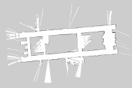

# Raspberry Pi 3BのみでRaspberry Pi Catのナビゲーション（屋内環境編）

* 文章: B3出野、B3畑中
* 文章の改竄: 上田

　「最近の移動ロボットはPCのスペック無駄に良い。贅沢だ」とロートル指導教員に言われたので、
ラズパイでナビゲーションできるか調査をしています。
最終的にはつくばチャレンジくらいの環境をラズパイで走破することが目標ですが、
とりあえず屋内でラズパイだけでロボットを走らせました。

## 実験方法

　RT社の[Raspberry Pi Cat](https://rt-net.jp/products/raspberry-pi-cat/)を用いて実験しました。
機体には北陽の2D LiDARが取り付けてあります。
実際の機体は後述の動画内でごらんください。

　Raspberry Pi Catにはモーターの制御用にRaspberry Pi 3Bが内蔵されていますが、
今回はLiDARの処理も、このラズパイを使って行います。
ソフトについては、以下のものをラズパイにインストールして使用しました。

・[raspicat_navigation](https://github.com/uhobeike/raspicat_navigation)

　実験場所は、千葉工業大学津田沼キャンパスの2号館19階の廊下です。
[gmapping](http://wiki.ros.org/gmapping)で作成した地図を示します。

この地図の解像度は、1区画0.3[m]です。
当初は0.05[m]にしていたのですが、DRAMが足りなくなりました。
せっかくなので、0.05[m]のものも示します。

## 実験結果

　走行時の動画です。廊下の一周が成功しました。

<iframe width="560" height="315" src="https://www.youtube.com/embed/tmFjHElCXa8" title="YouTube video player" frameborder="0" allow="accelerometer; autoplay; clipboard-write; encrypted-media; gyroscope; picture-in-picture" allowfullscreen></iframe>

## 考察

* 2D LiDAR程度であればラズパイで実時間処理可能 
    * （ラズパイマウスで実証済み。下の動画）
* 地図の区画数が多いとDRAMを圧迫するので、その制約を取り払うにはコードに手を入れる必要があるかもしれない

<iframe width="560" height="315" src="https://www.youtube.com/embed/7xXnXHc0roA" title="YouTube video player" frameborder="0" allow="accelerometer; autoplay; clipboard-write; encrypted-media; gyroscope; picture-in-picture" allowfullscreen></iframe>

## 今後

　外を走らせます。
