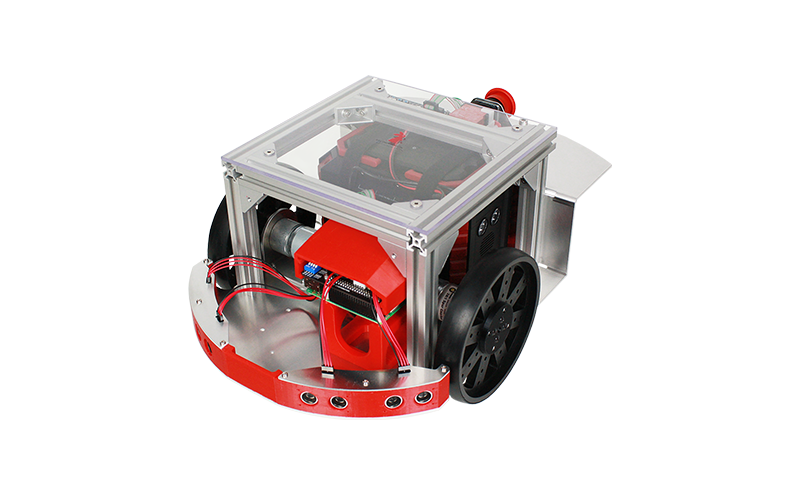
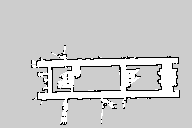

# A challenge of mobile robot navigation with just one Raspberry Pi 3B

## 目的

Raspberry Pi 3B のスペックでナビゲーションを行えるのかを調査することを目的とします。

## 実験
RT CORPORATION の Raspberry Pi Cat を用いて実験しました。

Packageは以下のものを使用しました。[raspicat_navigation](https://github.com/uhobeike/raspicat_navigation)

実験場所は、千葉工業大学津田沼キャンパスの2号館19階の廊下です。
この区間を一周させることで、ナビゲーションが行えたとします。

上図は、gmapping[http://wiki.ros.org/gmapping] で作成した19階の地図です。resolutionを0.30に設定しました。
## 実験結果
Youtubeにて、走行時の動画です。

目的である廊下の一周が成功しました。

## 考察・今後の活動
本実験で、地図の解像度・
今後は、千葉工業大学津田沼キャンパス内の指定された区間を走行することを目標とします。
